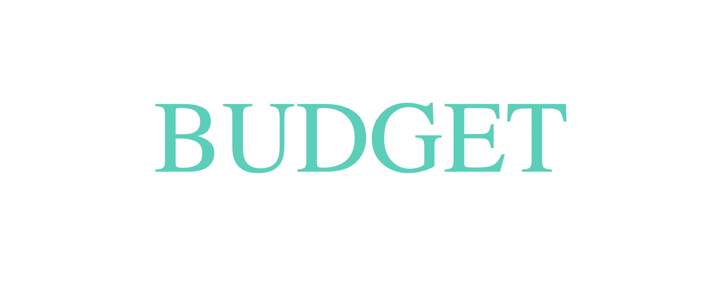
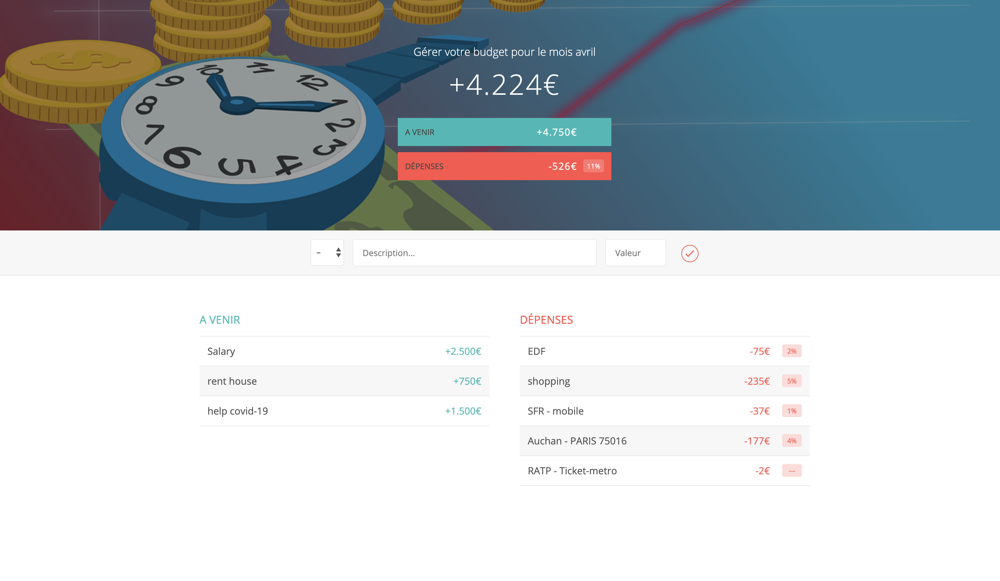

# Description

This project using html, css and javascript (ES5)

# ScreenShot



# Demo

To get the demo click of the website click here : [budget](https://azedine-batouche.github.io/budget/) .

# Setup

first clone the project in your workspace with this command line

```
git clone https://github.com/batouche-dev/budget.git
```

# Launch

```
cd budget
```

and then open index.html file with any browser: chrome, firefox, safari ...

